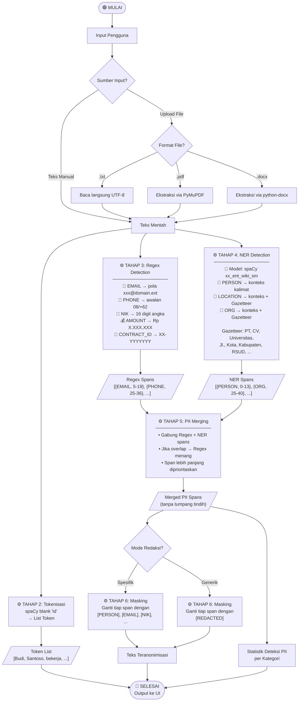

# Flowchart Pipeline PrivacyGuard AI

## Catatan Penting

| Langkah | Ada? | Keterangan |
|---|---|---|
| Ekstraksi Teks | ✅ | .txt / .pdf / .docx |
| Case Folding | ❌ | Sengaja tidak dilakukan — regex CONTRACT_ID & gazetteer butuh huruf kapital |
| Cleaning / Normalisasi | ❌ | Teks digunakan as-is dari hasil ekstraksi |
| Tokenisasi | ✅ | spaCy blank "id" — output dikembalikan ke UI sebagai informasi tambahan |
| Regex Detection | ✅ | Bekerja pada raw text (bukan token) |
| NER Detection | ✅ | Bekerja pada raw text; model spaCy melakukan tokenisasi internalnya sendiri |
| PII Merging | ✅ | Resolusi overlap dengan prioritas Regex |
| Masking | ✅ | Mode spesifik atau generik |
